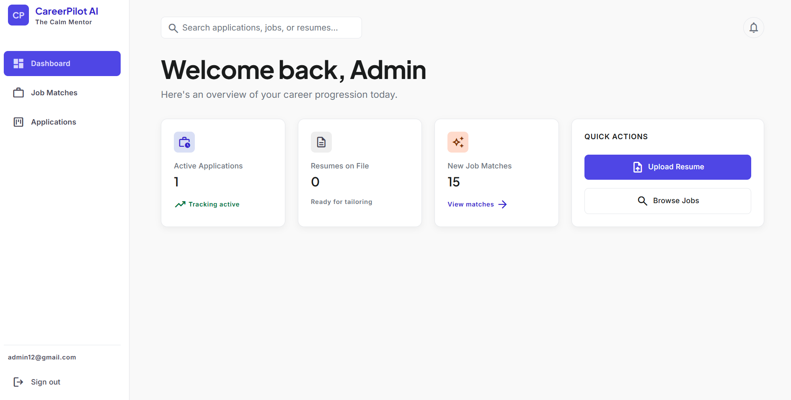
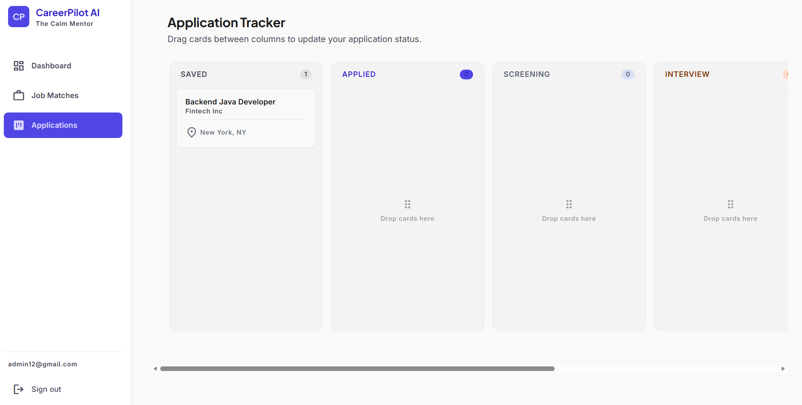

# CareerPilot AI 🚀

<p align="center">
  
  
  
  
</p>

**CareerPilot AI** is an intelligent, full-stack career management platform—"The Calm Mentor" that helps you navigate your career, discover job matches, tailor your resume for specific roles, and track your applications.

## ✨ Features

- **Resume Parsing & Skill Extraction:** Upload your resume (PDF/DOCX) and let AI extract your skills, experience, and professional profile.
- **AI-Powered Job Matching:** Discover relevant jobs (via Adzuna API integration) and instantly see how well your profile matches the job description, complete with a skill gap analysis.
- **ATS-Optimized Resume Tailoring:** Use OpenAI to automatically tailor your existing resume to a specific job posting. The system highlights relevant experience and minimizes hallucination.
- **Automated Artifact Generation:** Automatically generate polished, ATS-friendly PDF and DOCX versions of your tailored resume, stored securely in Cloudflare R2.
- **Application Tracking Kanban Board:** Seamlessly manage your job hunt by tracking applications through customizable stages (Saved, Applied, Interview, Offer, Rejected).
- **Secure Authentication:** Robust JWT-based authentication using `HttpOnly` secure cookies and refresh token rotation.

## 🛠️ Tech Stack

### Frontend
- **Framework:** Next.js 14 (App Router), React
- **Styling:** Tailwind CSS
- **State Management:** Zustand, TanStack React Query
- **Networking:** Axios

### Backend
- **Framework:** Java 21, Spring Boot 3
- **Security:** Spring Security (JWT, Rate Limiting, CORS)
- **Database:** PostgreSQL (with Flyway for database migrations)
- **Caching:** Redis
- **Cloud Storage:** Cloudflare R2 (S3-Compatible)
- **AI Integration:** OpenAI API

## 🚀 Getting Started

### Prerequisites
- Node.js (v18+)
- Java 21
- Docker and Docker Compose (recommended for running databases)
- OpenAI API Key
- Cloudflare R2 Credentials

### 1. Start Dependencies (Docker)

The easiest way to run PostgreSQL and Redis locally is by using the provided `docker-compose.yml` file in the root directory:

> [!NOTE]
> Make sure your Docker Engine (e.g., Docker Desktop) is running before executing this command.

```bash
docker-compose up -d
```
*(This will start PostgreSQL on port `5433` and Redis on port `6379`)*

### 2. Backend Setup

Navigate to the backend directory:
```bash
cd careerpilot-backend
```

Configure your environment variables in `src/main/resources/application.yml` or export them in your terminal:
- `DB_USER` / `DB_PASSWORD` (defaults to `careerpilot`)
- `OPENAI_API_KEY`
- `ADZUNA_APP_ID` / `ADZUNA_APP_KEY`
- `R2_ACCESS_KEY` / `R2_SECRET_KEY` / `R2_ENDPOINT` / `R2_BUCKET_NAME`

Run the Spring Boot application:
```bash
# Windows
.\mvnw.cmd spring-boot:run

# Mac/Linux
./mvnw spring-boot:run
```
*(The backend will run on `http://localhost:8080`)*

To run the automated test suite:
```bash
.\mvnw.cmd test
```

### 3. Frontend Setup

Navigate to the frontend directory:
```bash
cd careerpilot-frontend
```

Install the dependencies:
```bash
npm install
```

Create a `.env.local` file in the `careerpilot-frontend` directory and add your API URL:
```env
NEXT_PUBLIC_API_URL=http://localhost:8080/api/v1
```

Start the development server:
```bash
npm run dev
```

Open [http://localhost:3000](http://localhost:3000) with your browser to see the application!

### 4. Stopping the Services

To gracefully shut down the application:
1. **Frontend & Backend**: Press `Ctrl + C` in their respective terminal windows.
2. **Docker Dependencies**: Run the following command in the root directory to stop and remove the database containers:
```bash
docker-compose down
```

## 🧪 Testing and Building

**Frontend Production Build:**
```bash
cd careerpilot-frontend
npm run build
```

**Backend Tests:**
```bash
cd careerpilot-backend
.\mvnw.cmd test
```

## 📝 License

This project is licensed under the MIT License.
